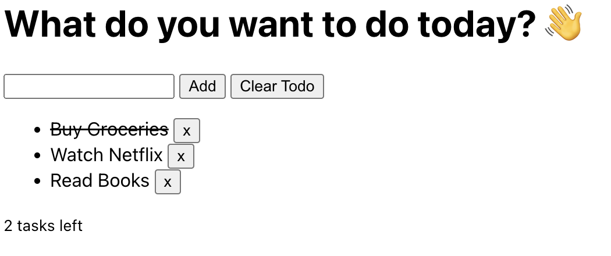

# Final Assessment - Hands on Challenge

## Overview

Welcome to the Part two of our Final Assessment in our Lunch & Learn Training!!!

For this Part two, students would require to code and do our coding challenges below. The application is a simple todo list which let's you add, complete, clear a task.

Good Luck in your Final Exam Challenge!!! 🥳🎉🍾

> **Important**: Your primary goal is to implement all the challenges below to make the application working.



## How to run

Install the dependencies

```sh
npm install
```

Run on your local machine

> Note: When you run, you'll see a blank screen in the web page which is expected. The application isn't functional yet you need to complete the challenges below in-order to make it functional.

```sh
npm run dev
```

You can browse your application in <http://localhost:2000>

## Challenges

The application is already setup for you. You only need to edit the `src/final-exam.ts` file and do the challenges.

****

### Challenge #1: Create custom Type

Create a `type` named `TaskItem` which has a properties of:

- `id` with a type `string`
- `task` with a type of `string`
- `completed` with a type of `boolean`.

****

### Challenge #2: Create an array with custom type

Create an array named `tasks` that will hold your list of TODOs. Use the let variable with a custom type of interface that you declare above. [Challenge #1](Challenge-#1:-Create-an-Interface).

Add an initial values in your tasks array using the values below:

```typescript
[
   { id: uuid(), task: 'Buy Groceries' },
   { id: uuid(), task: 'Watch Netflix' },
   { id: uuid(), task: 'Read Books' }
]
```

> **Note**: There's an error in TypeScript and you need to identify and fix the error.
>
>
> In Challenge #1, identify and fix the property in your type in your `TaskItem` type.

****

### Challenge #3: Implement add tasks

Implement the `addItem` function to add an item in your `tasks` array. The `addItem` function should accepts a parameter of `task` with type of `string`.

> **TIP** #0: You can use the array built-in method `push` to add a new item in the array.

> **TIP** #1: Make sure to export your `addItem` function and add a return type to it.

****

### Challenge #4: Implement complete tasks

Implement the `completeItem` function to mark as complete the specific task. The `completeItem` function accepts parameter of `id` with a type of `string`. The `id` is the task which will be marked to be complete.

> **TIP** #0: To complete a task, you can use the array built-in method `map` to iterate each item in the array and update the `completed` property to `true`.

> **TIP** #1: Don't forget to update the values of `tasks` array variable above.

> **TIP** #2: Make sure to export your `completeItem` and add a return type to it.

****

### Challenge #5: Implement clearItems tasks

Complete the `clearItems` functionality below to clear all tasks in your todo lists.

Don't forget to update the `tasks` array variable above to update your tasks values.

> **TIP** #0: Make sure to export your `clearItems` and add a return type to it.

Once you're done implementing all the challenges above, make sure to check the app and functionality is fully working.

### Bonus Challenge

Imagine you are going to ship your project to production and you need to transpile the project into normal JavaScript.

Add a new special `script` in your `package.json` file to build the project, and add another `script` to run the project using the build files.
